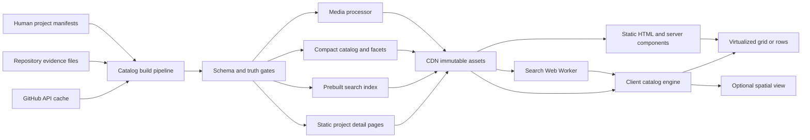

# Portfolio Platform PRD

**Product:** Project Atlas  
**Document type:** Product Requirements Document + architecture contract  
**Status:** Approved for implementation planning  
**Target scale:** 1,300 projects without architectural replacement; 10,000-project migration path  
**Primary users:** technical recruiters, hiring engineers, engineering leaders, founders/VCs, open-source maintainers  
**Related catalog:** `portfolio-project-selection.md`

## 0. Non-negotiable architectural decisions

1. **The catalog is static-first.** Project metadata is compiled during CI into immutable, content-hashed artifacts and served from a CDN. The browser never calls GitHub to render a page.
2. **GitHub enriches the catalog; it is not the source of truth.** Human-authored project manifests control titles, claims, role mapping, evidence, ordering, and visibility. Repository data may fill objective fields such as stars, releases, topics, commit date, and license.
3. **Dedicated project URLs are mandatory.** `/projects/{slug}` is canonical for deep links, search engines, accessibility, sharing, and browser history. A desktop overlay may use route interception, but it cannot replace the URL.
4. **The default experience is two-dimensional.** The first screen shows role positioning and five flagship proofs. The default archive view is a fast evidence grid. Three-dimensional rendering is an opt-in visualization with a hard resource ceiling.
5. **Virtualization is view-specific, not dogmatic.** The dense row view uses fixed-height virtualization. The bento view virtualizes deterministic rows. Project detail pages and small filtered result sets render normally.
6. **Search and filtering never block the main thread.** Search runs in a Web Worker against a prebuilt index. Facet filtering uses dictionary-encoded bitsets and intersects with search results.
7. **The initial route does not contain full project records.** It receives a compact card catalog. Long narratives, diagrams, galleries, and evidence are fetched by project slug or included in statically generated detail pages.
8. **No runtime database is required for v1.** Add a search service or database only after measured client limits are crossed or authenticated editing becomes a requirement.
9. **Performance is a release feature.** Budgets are enforced in CI. A visual effect that breaks a budget is removed, not excused.
10. **Truth outranks spectacle.** No fabricated users, revenue, savings, uptime, scale, or AI-generated claims. Synthetic benchmarks are labeled as synthetic and include the environment and evidence.

## 1. Executive summary

Project Atlas is an IDE-grade public archive for a software engineer whose work spans AI, backend, and full-stack engineering. It is not a cinematic résumé and not an infinite gallery. It is a proof-retrieval system.

The product must let a first-time visitor answer four questions with minimal work:

- What roles is this engineer credible for?
- What are the five strongest systems?
- Where is the evidence—source, live system, architecture, tests, benchmarks, evaluations, incident artifacts, or accepted contributions?
- Can I find a specific language, problem domain, system property, or year in seconds?

The platform must remain responsive with 1,300 catalog entries and must define an upgrade path to 10,000 entries. It must render useful HTML without JavaScript, support keyboard and screen-reader navigation, expose stable project URLs, and progressively add search, filtering, virtualization, motion, and optional 3D.

### 1.1 Red-team correction: what actually breaks

The number `300` is not the browser limit. A compact array of 1,300 project summaries is small. The dangerous multiplication is rich card complexity:

- **DOM:** 1,300 cards × 30 descendants = 39,000 elements before navigation, dialogs, and filters. Style recalculation, selector matching, accessibility-tree construction, layout, and React reconciliation become expensive.
- **Decoded media:** 1,300 thumbnails at 800 × 450 × 4 bytes require about **1.87 GB** of decoded pixel memory. Even 400 × 225 thumbnails require about **468 MB** before browser overhead.
- **Per-card behavior:** one observer, listener, animation controller, and local state object per card produces unnecessary retained memory and callback pressure.
- **Filtering:** scanning 1,300 records is cheap; synchronously rerendering hundreds of complex cards after every keystroke is not.
- **Variable masonry:** measuring unknown card heights during scroll causes forced layout, scroll-anchor instability, and cache invalidation in the virtualizer.
- **WebGL:** loading a Three.js runtime, textures, geometry, labels, hit testing, and a permanent animation loop competes with input, scrolling, and battery. It also creates an accessibility dead end if used as primary navigation.
- **Monolithic JSON:** shipping complete case studies, diagrams, metric histories, and gallery metadata on the archive route converts a manageable catalog into a multi-megabyte parse and hydration task.

The defensive design is compact data, deterministic geometry, bounded DOM/media, worker-based search, bitset filtering, event delegation, route-level detail loading, and opt-in advanced rendering.

## 2. Incentive map and product behavior

| User | Actual incentive | Product response | Success event |
|---|---|---|---|
| Technical recruiter | Determine role fit and credibility quickly | Role switcher, five flagship proofs, short claims, résumé/contact always reachable | Opens a flagship or résumé within 30 seconds |
| Hiring engineer | Inspect depth and personal decisions | Architecture, ADRs, source, tests, benchmarks, failure analysis, clear ownership | Opens evidence or source from a case study |
| Engineering leader | Assess system judgment and communication | Tradeoffs, constraints, SLOs, security, costs, postmortems, scale path | Reads a technical deep dive |
| Founder or VC | Assess product judgment and shipping ability | User/problem framing, scope decisions, validation status, delivery chronology | Opens product outcome and implementation evidence |
| Open-source maintainer | Verify contribution quality and collaboration | Accepted PRs/issues, review discussion, tests, docs, upstream links | Follows an upstream contribution link |

The product must not require these users to understand the catalog taxonomy before seeing proof. Search and filters accelerate investigation; they do not replace editorial hierarchy.

## 3. Goals, non-goals, and success metrics

### 3.1 Goals

- Present five flagship projects above the archive and provide AI, Backend, and Full Stack role lenses.
- Search 1,300 projects by title, claim, summary, technology, language, domain, capability, artifact, and project ID.
- Filter instantly across multiple facet groups while keeping state shareable in the URL.
- Support rich grid, dense row, and optional spatial views without duplicating catalog state.
- Generate project data, search indexes, facets, sitemaps, feeds, and route payloads from validated manifests.
- Make every public claim traceable to an evidence URL or explicitly marked as qualitative.
- Maintain WCAG 2.2 AA behavior and good field Core Web Vitals at the 75th percentile.

### 3.2 Non-goals

- A CMS, social network, comments system, visitor accounts, or collaborative editor in v1.
- Live GitHub API calls from the browser.
- Rendering every project card, image, or 3D node simultaneously.
- Treating commit count, line count, framework count, or repository count as proof of competence.
- Recreating Mobbin, Linear, Vercel, or an award-site portfolio visually.
- Guaranteeing a universal Lighthouse 100. Lighthouse is a lab diagnostic with run-to-run variance; field responsiveness is the release criterion.

### 3.3 Product success metrics

- At least 70% of qualified sessions open a project, résumé, source repository, or evidence artifact.
- Median time from landing to first proof interaction: **≤20 seconds**.
- Search-to-project-open conversion: **≥35%** once at least 200 entries are indexed.
- Zero public projects without `proofLevel`, `status`, and at least one evidence link.
- Zero unlabeled synthetic performance or impact metrics.
- For every route/device cohort with adequate traffic, the 75th-percentile field values meet Section 9 targets on at least **95% of days** in a rolling 28-day window.

## 4. Technical stack hypothesis

| Layer | Decision | Reason |
|---|---|---|
| Framework | Next.js App Router, latest stable version pinned exactly | Static generation, server-rendered metadata, route-level code splitting, canonical detail routes, React Server Components |
| Language | TypeScript with `strict`, `noUncheckedIndexedAccess`, and exact schema-derived types | Prevent catalog/data-contract drift |
| Rendering | Static/prerendered HTML plus small client islands | The portfolio is read-heavy and changes at deploy time, not per request |
| Styling | Tailwind CSS for constrained utilities plus CSS custom-property design tokens | Fast implementation without runtime styling; tokens remain framework-independent |
| Component primitives | Headless, accessible primitives or native HTML; custom visual layer | Preserve keyboard/focus semantics while owning the design |
| Virtualization | `react-window` for fixed row/grid primitives; custom deterministic row packer for bento spans | Fixed geometry avoids measurement thrash; the library supports large lists/grids and server defaults |
| Search | Fuse.js with a CI-built index, loaded inside a dedicated Web Worker | 1,300 entries are below the point where a hosted search system earns its complexity |
| Facets | Integer dictionaries plus `Uint32Array` bitsets | Predictable memory and fast OR-within/AND-across filtering |
| Validation | JSON Schema 2020-12 plus Zod runtime/build validation | Machine-readable contract and TypeScript ergonomics |
| Ingestion | Node.js TypeScript CLI in a workspace package; GitHub Actions orchestration | Deterministic local and CI behavior |
| Media | Build-time image pipeline producing AVIF/WebP/JPEG fallbacks and intrinsic dimensions | No layout shift and no origin-time transformation dependency |
| Motion | CSS transitions first; Motion `LazyMotion` only for stateful sequences | Keep common interactions off the JavaScript animation path and defer optional features |
| 3D | Three.js/react-three-fiber in an explicit, dynamically imported route island | Prevent 3D from contaminating the default bundle and accessibility model |
| Observability | `web-vitals` RUM, error reporting, deployment version, privacy-minimized product events | Verify field behavior and debug regressions |
| Hosting | CDN-backed Next.js deployment; immutable hashed assets; preview deployment per pull request | Global static delivery and reviewable changes |

### 4.1 Dependency policy

- Pin exact versions in the lockfile; automate reviewed update pull requests.
- No library is allowed merely because it is fashionable. Each client dependency needs an ADR stating capability, compressed cost, fallback, and removal path.
- Do not ship React Query, Redux, Zustand, D3, Motion, or Three.js on routes that do not use them.
- Prefer CSS and browser primitives for hover, focus, disclosure, sticky positioning, and simple transitions.
- Keep all catalog logic behind framework-neutral TypeScript interfaces so a future renderer can replace React without replacing the data engine.

## 5. Core functional specifications

### 5.1 Data ingestion and publication pipeline

#### 5.1.1 Source model

The canonical input is one reviewed manifest per project under `content/projects/{project-id}.json`. Markdown case studies may reference the project ID but cannot redefine catalog metadata.

Source precedence is fixed:

1. Human-authored manifest fields.
2. Repository-local machine-readable evidence files.
3. GitHub API enrichment.
4. Deterministic derived values.
5. Never: unreviewed generative inference.

GitHub must not overwrite a curated title, summary, role, proof level, metric, display order, or visibility state. If GitHub and the manifest disagree on a factual field, the build emits a review warning and preserves the manifest until a human resolves it.

#### 5.1.2 Pipeline stages

```text
discover → parse → schema validate → normalize → deduplicate
         → enrich from cache/GitHub → verify evidence → derive facets
         → process media → build compact catalog → build search index
         → build bitsets → generate detail payloads/sitemaps/feed
         → enforce budgets → publish immutable manifest
```

Every stage must be a pure or explicitly side-effecting function with structured logs, duration metrics, input/output counts, and a stable error code.

#### 5.1.3 Ingestion requirements

- Discover only allowlisted extensions and directories. Ignore symlinks that resolve outside the repository.
- Validate every record against the current schema version before enrichment.
- Normalize Unicode to NFC, trim whitespace, lowercase identifiers, canonicalize URLs, and sort unordered tag arrays.
- Reject duplicate `id`, `slug`, canonical repository URL, and case-study URL values.
- Reject unknown facet values unless the manifest adds them to the controlled vocabulary through a reviewed taxonomy change.
- Reject a public project with missing summary, roles, proof level, status, primary evidence, image alt text, or canonical URL.
- Reject metrics without environment, measurement date, evidence, and `synthetic` status.
- Reject image records without intrinsic width and height.
- Verify internal links on every build. Verify external links on a scheduled job with bounded concurrency, timeout, retry, and an allowlist for known anti-bot responses.
- Produce an audit report listing additions, removals, field changes, stale records, broken evidence, taxonomy changes, and budget deltas.
- Builds are deterministic: identical normalized inputs and cached enrichment must produce byte-identical artifacts.

#### 5.1.4 GitHub enrichment

- Run only in CI or an explicit maintainer command using a least-privilege token. No token reaches the browser, bundle, logs, or preview output.
- Prefer webhook-triggered or change-triggered enrichment. Scheduled reconciliation may run once daily; local development uses fixtures or the cache.
- Use authenticated conditional requests with ETags/`If-None-Match`. A `304` reuses the cached normalized response.
- Queue requests; default concurrency **2**, request timeout **10 seconds**, maximum two retries for transient failures, exponential backoff with full jitter, and strict compliance with `Retry-After` and rate-limit reset headers.
- Abort enrichment when remaining API budget falls below **10%**. Publish from the last valid cache only if cached records are younger than **7 days**; otherwise fail the production build.
- Store only fields used by the product: repository URL, default branch, description, topics, primary language, license identifier, stars, forks, open issues, archived flag, latest push, latest release, and homepage.
- Never rank projects by stars, commit count, or recency alone. These values are context, not competence scores.

#### 5.1.5 Generated artifacts

| Artifact | Contents | Compressed budget at 1,300 projects | Cache policy |
|---|---|---:|---|
| `manifest.{hash}.json` | schema/build version, content hashes, artifact URLs, counts | 20 KB | immutable, 1 year |
| `catalog-core.{hash}.json` | card/search identifiers and short display fields | 500 KB | immutable, 1 year |
| `facets.{hash}.json` | dictionaries, counts, labels, ordering | 80 KB | immutable, 1 year |
| `facet-bits.{hash}.bin` | packed membership bitsets | 100 KB | immutable, 1 year |
| `search.{hash}.json` | serialized Fuse index and compact search documents | 900 KB | immutable, 1 year |
| `featured.{hash}.json` | role-specific flagship selections and editorial groups | 25 KB | immutable, 1 year |
| `projects/{slug}.{hash}.json` | complete project record for client transitions | 100 KB per project maximum | immutable, 1 year |
| static detail HTML | crawlable case study and metadata | 250 KB per page maximum | CDN cached; purge on deploy |

Budgets are Brotli-compressed transfer budgets. The archive route must not download `search`, facet bitsets, or any detail payload until needed. The first rendered view may inline or preload only the first editorial slice and compact facet labels.

#### 5.1.6 Build service-level objectives

- Warm incremental build of one changed project: **≤30 seconds**.
- Full 1,300-project catalog build with cached GitHub data: **≤120 seconds** on the CI reference runner.
- Cold build including permitted enrichment and media verification: **≤5 minutes**.
- Invalid records produce file path, JSON pointer, rule ID, rejected value, and suggested repair.
- A production artifact is published only after schema, link, media, search, uniqueness, accessibility-metadata, and budget gates pass.

### 5.2 Power-user command palette

#### 5.2.1 Entry and lifecycle

- Open with `Meta+K` on macOS, `Ctrl+K` elsewhere, the visible search button, or `/` when focus is not inside an editable field.
- The palette is an accessible modal dialog with a labeled combobox, listbox results, focus containment, `Escape` close, restored trigger focus, and no keyboard trap.
- Initial shell opens in **≤50 ms** after the command. It may show recent/featured commands while the search worker becomes ready.
- Preload the worker and index on the earliest of: search-button hover, search-button focus, **2-second** idle callback, or explicit shortcut.
- If JavaScript or the worker fails, submit the query to `/projects?q=...` and perform a synchronous bounded search after navigation.

#### 5.2.2 Search documents and weighting

The worker receives a compact record, not the full `Project` object:

```json
{
  "i": 417,
  "id": "RAG-01",
  "slug": "atlasops-governed-knowledge-platform",
  "t": "AtlasOps Governed Knowledge Platform",
  "c": "Production RAG with hybrid retrieval, evaluation, access control and cost observability",
  "x": ["typescript", "python", "fastapi", "nextjs", "qdrant", "pgvector"],
  "r": ["ai-engineer", "backend-engineer"],
  "d": ["rag", "search", "llmops"],
  "a": ["benchmark", "evaluation", "threat-model", "runbook"],
  "y": 2026,
  "p": 4
}
```

Fuse configuration baseline:

```json
{
  "includeScore": true,
  "includeMatches": true,
  "shouldSort": true,
  "ignoreLocation": true,
  "findAllMatches": false,
  "minMatchCharLength": 2,
  "threshold": 0.32,
  "keys": [
    { "name": "id", "weight": 0.30 },
    { "name": "t", "weight": 0.28 },
    { "name": "x", "weight": 0.14 },
    { "name": "d", "weight": 0.10 },
    { "name": "c", "weight": 0.08 },
    { "name": "r", "weight": 0.05 },
    { "name": "a", "weight": 0.05 }
  ]
}
```

These values are acceptance-test baselines, not sacred defaults. A labeled relevance suite of at least **150 queries** decides changes. It must cover exact IDs, title prefixes, misspellings, acronyms, technologies, cross-field queries, role queries, and no-result cases.

#### 5.2.3 Query execution

- Normalize query Unicode, whitespace, punctuation aliases, common technology aliases, and project IDs without destroying displayed text.
- Exact project ID and exact title matches bypass fuzzy ranking and appear first.
- Increment a query sequence number. Discard worker responses older than the latest sequence.
- Debounce dispatch by **40 ms** after the first character; do not delay arrow-key navigation or exact ID matches.
- Return a maximum of **50** ranked IDs from the worker. Render **12** in the palette and virtualize only if a future design displays more than 30.
- Search relevance dominates editorial priority. `proofLevel` may break near-ties but cannot move a weak text match above a strong match.
- Highlight matched ranges without injecting HTML. Render text nodes from range boundaries.
- Query p95 in the worker: **≤30 ms** at 1,300 projects and **≤50 ms** at the 10,000-project soak fixture on the CI performance machine.
- Main-thread work from a completed query through painted results: **≤16 ms p95**.
- Search worker retained memory: **≤12 MB** at 1,300 projects.

#### 5.2.4 Commands

The palette supports navigational commands using the same result contract:

- `role:ai`, `role:backend`, `role:fullstack`
- `view:grid`, `view:rows`, `view:spatial`
- `lang:{value}`, `tech:{value}`, `year:{value}`, `proof:{value}`
- `resume`, `contact`, `github`, `writing`, `open-source`

Commands must be discoverable as labeled suggestions; undocumented parser syntax is not a substitute for UI.

### 5.3 Multi-dimensional filtering engine

#### 5.3.1 Facets

Required facet groups:

- Role: AI Engineer, Backend Engineer, Full Stack Engineer.
- Project tier: flagship, keystone, case study, focused exhibit.
- Proof level: code, live system, measured, externally validated.
- Language and technology.
- Capability: API, distributed systems, security, SRE, data, ML, model serving, RAG, workstreams, accessibility, performance, system design.
- Artifact: benchmark, evaluation, ADR, runbook, postmortem, threat model, model card, design doc, accepted upstream contribution.
- System complexity: single-process, service, distributed, data platform, ML system, AI system.
- Year, status, and source availability.

“Impact metric” is not a free-form filter. Metrics must be grouped into controlled categories such as latency, throughput, reliability, cost, quality, accessibility, adoption, or external validation. Numeric comparison requires compatible units.

#### 5.3.2 Bitset representation

- Assign every catalog entry a stable zero-based ordinal for the current build.
- Assign every facet value an integer ID.
- Store membership as `Uint32Array(Math.ceil(projectCount / 32))`.
- OR selected values within one facet group; AND the resulting group bitsets across groups.
- Convert the final bitset to ordered project ordinals only after applying the current sort.
- At 1,300 projects, one bitset contains **41 32-bit words = 164 bytes**. Two hundred facet values require roughly **32.8 KB** before serialization overhead.
- The search worker returns a result bitset or ordered ID list; filters intersect it without rescanning text.

#### 5.3.3 State and interaction

- Canonical state lives in URL search parameters: `q`, `role`, `tier`, `proof`, `lang`, `tech`, `capability`, `artifact`, `complexity`, `year`, `status`, `sort`, and `view`.
- Use repeated parameters for multi-select values. Sort parameter names and values before writing the URL to guarantee stable share links.
- Browser back/forward restores the exact query, filters, sort, view, and focused project.
- Persist only presentation preferences such as density and last view in local storage. Do not allow stored state to silently override an explicit URL.
- Show selected filters as removable tokens, clear-all, per-group counts, and total result count.
- Use one delegated event boundary for grid interactions. Do not attach document listeners or observers per card.
- Filter computation target: **≤4 ms median, ≤8 ms p95** for 1,300 projects; **≤16 ms p95** for the 10,000-project fixture.
- Applying a filter must not create a task over **50 ms**, move focus unexpectedly, or reset scroll without an announced reason.

### 5.4 View-state engine

All views consume `VisibleProjectIds`, the single ordered output of search + facets + sort. Views may not implement independent filtering logic.

#### 5.4.1 Evidence grid

- Default archive view on desktop and tablet.
- Deterministic card variants: `standard`, `wide`, and `feature`. No arbitrary content-driven masonry.
- Pack cards into rows during data preparation based on explicit spans and breakpoint rules. The virtualizer operates on rows with known heights.
- Render **3 viewport rows** above and below the visible region. Target **18–36 cards** mounted during normal use; hard maximum **60**.
- Every media frame reserves an intrinsic aspect ratio. Card text uses bounded line clamps; expanded content belongs on the detail route.
- No DOM reads followed by writes inside the same frame. `ResizeObserver` updates container width only; row geometry is computed from width and design tokens.
- When the filtered set contains **≤60** cards, normal rendering is permitted if measured DOM and interaction budgets remain green.

#### 5.4.2 Dense terminal/row view

- Primary recruiter speed mode and default on narrow desktop heights when previously selected.
- Fixed row height: **52 px compact**, **64 px comfortable**.
- Use `react-window` with stable project ID keys and overscan of **6 rows**.
- Columns: project ID, title, roles, primary stack, proof level, year, status, and evidence shortcuts.
- Use `aria-rowcount`, `aria-rowindex`, sortable column labels, and predictable keyboard navigation.
- Provide a paginated semantic-list fallback of **50 projects per page** for assistive technology modes that do not work reliably with virtualized grids.

#### 5.4.3 Spatial/3D view

- Optional route or explicitly activated mode. Never the default, never the only navigation, and never included in the initial route bundle.
- Load only the current filtered result set, capped at **120 nodes**. If more remain, require a tighter filter or sample by an explained deterministic rule.
- Do not use one texture or DOM label per project. Use atlas textures, instancing, and a single accessible synchronized list outside the canvas.
- Desktop target: **60 FPS** with p95 frame time **≤16.7 ms** on the reference device. Mobile target: **30 FPS** with p95 frame time **≤33 ms**.
- Cap device pixel ratio at **1.5**, draw calls at **50**, decoded GPU textures at **32 MB**, and total incremental JS heap at **40 MB**.
- Pause the animation loop when the canvas is outside the viewport, the document is hidden, a project overlay is open, reduced motion is requested, or no input/animation has occurred for **2 seconds**.
- Render on demand when idle. Continuous rendering requires an active transition, camera motion, or pointer interaction.
- Handle WebGL context loss and fall back to the evidence grid without losing query/filter state.
- On `prefers-reduced-motion: reduce`, do not initialize automatic camera movement, parallax, particle motion, or animated transitions.

## 6. Information architecture and user journeys

### 6.1 Route map

| Route | Purpose | Rendering |
|---|---|---|
| `/` | positioning, role entry, five flagships, concise credibility evidence | static HTML; minimal client JS |
| `/ai-engineer` | AI-specific proof ordering and résumé narrative | statically generated |
| `/backend-engineer` | backend-specific proof ordering and résumé narrative | statically generated |
| `/full-stack-engineer` | full-stack-specific proof ordering and résumé narrative | statically generated |
| `/projects` | searchable and filterable project atlas | static shell + client catalog engine |
| `/projects/{slug}` | canonical project case study | statically generated detail page |
| `/systems` | architecture, benchmarks, SRE, security, and system-design artifacts | statically generated index |
| `/writing` | technical articles and talks | statically generated index/details |
| `/open-source` | upstream contributions and collaboration evidence | statically generated index |
| `/resume` | accessible HTML résumé plus versioned PDF link | static |
| `/contact` | low-friction contact paths and availability | static; no third-party form dependency required |

### 6.2 Home-page hierarchy

The home page is not the 1,300-project archive. It contains:

1. One sentence stating the three target roles and engineering specialization.
2. Three role lenses with direct links.
3. Five flagship project proofs with one hard claim and one evidence action each.
4. A compact proof bar: production systems, measured reports, accepted contributions, incident/reliability artifacts, and accessibility/security evidence. No line-count or commit-count “flex.”
5. A clear entry into the project atlas and command palette.
6. Résumé, GitHub, and contact paths visible without scrolling on common desktop viewports and available in the mobile header.

### 6.3 Project detail requirements

Every project route must expose, in this order:

- Claim, status, role relevance, proof level, and the engineer’s responsibility.
- Demo, source, case study, and primary evidence actions.
- Problem, user, constraints, non-goals, and system boundary.
- Architecture and data flow.
- Three consequential decisions with alternatives and tradeoffs.
- Measured evidence with environment and date.
- Reliability, security/privacy, accessibility, and testing evidence as applicable.
- Failure or discarded approach.
- Limitations and next scale threshold.
- Related projects and reused platform components.

Project pages must not hide core evidence in hover-only interactions, carousels, or modal-only media.

### 6.4 Primary journeys

**Recruiter journey:** landing → select role or inspect flagship → scan claim/proof → open résumé/source/contact. No mandatory command palette or filters.

**Hiring engineer journey:** direct project URL or role page → architecture → evidence → source/tests → related system artifact.

**Maintainer journey:** open-source index → upstream PR/issue → local contribution explanation → tests and review history.

**Power-user journey:** `Cmd/Ctrl+K` → type project ID, technology, or capability → arrow to result → `Enter` → stable project URL.

**Archive journey:** choose filters → switch density/view → share URL → back/forward restores state and focus.

## 7. System architecture



### 7.1 Runtime boundaries

**Server/build boundary**

- Owns validation, GitHub authentication, enrichment, media generation, search-index creation, bitset creation, static metadata, sitemaps, RSS/JSON feeds, and project detail HTML.
- Never sends repository tokens, draft records, private metrics, raw build logs, or unreviewed generated text to the client.

**Main-thread client boundary**

- Owns URL state, focus, keyboard input, compact project-card rendering, virtualizer geometry, view switching, and accessible announcements.
- Does not build the fuzzy index, parse project detail bodies for the archive, decode offscreen media eagerly, or run a permanent animation loop.

**Worker boundary**

- Owns search-index hydration, query normalization, fuzzy search, ordered result IDs, query sequence handling, and search timings.
- Communicates with versioned discriminated messages. Unknown versions terminate the worker and activate fallback behavior.

**Optional graphics boundary**

- Owns WebGL scene state only after explicit activation.
- Receives filtered compact nodes. It cannot own canonical filters, selection, URLs, project content, or navigation history.

### 7.2 Catalog engine state

```ts
type CatalogState = {
  query: string;
  selected: Readonly<Record<FacetGroup, readonly FacetValueId[]>>;
  sort: "relevance" | "proof" | "year-desc" | "year-asc" | "title";
  view: "grid" | "rows" | "spatial";
  density: "compact" | "comfortable";
  orderedIds: readonly ProjectOrdinal[];
  focusedId: ProjectId | null;
  search: {
    phase: "idle" | "loading" | "ready" | "failed";
    sequence: number;
    latencyMs?: number;
  };
};
```

State transitions run through one reducer or external store with selectors. Card components receive primitive display fields and stable callbacks. They do not subscribe to the full state object.

### 7.3 Cache and invalidation model

- Every generated data and media file includes a content hash and receives `Cache-Control: public, max-age=31536000, immutable`.
- HTML receives CDN caching appropriate to the host and is invalidated by deployment.
- The unhashed bootstrap manifest uses a short TTL of **5 minutes** and points to hashed artifacts.
- A deployment publishes artifacts before HTML/manifest pointers. Never publish pointers to missing content.
- Service workers are excluded from v1. They add update and invalidation failure modes without a validated offline requirement.

### 7.4 Scale migration triggers

Keep client search until any two of these conditions persist for three production releases:

- Search artifact exceeds **2 MB Brotli**.
- Worker initialization exceeds **250 ms p95** on reference mobile hardware.
- Query latency exceeds **50 ms p95** at real catalog size.
- Catalog exceeds **10,000** public records.
- Requirements add typo analytics, multilingual stemming, access-controlled results, or near-real-time updates.

At that point, introduce an edge/search service behind the same `SearchRequest`/`SearchResponse` contract. Do not rewrite view or filter components.

## 8. Project data contract

### 8.1 Canonical project object

The following is an illustrative record, not a claim that the project or metrics already exist.

```json
{
  "schemaVersion": 3,
  "id": "RAG-01",
  "slug": "atlasops-governed-knowledge-platform",
  "title": "AtlasOps Governed Knowledge Platform",
  "shortTitle": "AtlasOps",
  "tagline": "Grounded enterprise knowledge retrieval with measurable quality and controlled agent actions.",
  "summary": "A multi-tenant RAG platform with versioned ingestion, hybrid retrieval, reranking, access control, evaluation, and cost/latency observability.",
  "status": "in-progress",
  "visibility": "public",
  "tier": "flagship",
  "proofLevel": "measured",
  "featured": {
    "global": true,
    "roles": ["ai-engineer", "backend-engineer"],
    "rank": 1
  },
  "roles": ["ai-engineer", "backend-engineer"],
  "domains": ["knowledge-management", "developer-tools"],
  "capabilities": [
    "rag",
    "hybrid-search",
    "llm-evaluation",
    "multi-tenancy",
    "observability",
    "security"
  ],
  "complexity": "ai-system",
  "dates": {
    "started": "2026-09-01",
    "completed": null,
    "lastVerified": "2026-09-15"
  },
  "ownership": {
    "kind": "solo",
    "responsibilities": [
      "product specification",
      "system architecture",
      "backend implementation",
      "evaluation design",
      "frontend implementation",
      "deployment"
    ],
    "collaborators": []
  },
  "stack": {
    "languages": ["python", "typescript", "sql"],
    "frameworks": ["fastapi", "nextjs"],
    "data": ["postgresql", "pgvector", "qdrant", "redis"],
    "infrastructure": ["docker", "kubernetes", "opentelemetry"],
    "ai": ["vllm", "sentence-transformers"],
    "testing": ["pytest", "playwright", "k6"]
  },
  "links": {
    "canonical": "/projects/atlasops-governed-knowledge-platform",
    "live": "https://example.invalid/atlasops",
    "source": "https://github.com/example/atlasops",
    "caseStudy": "/projects/atlasops-governed-knowledge-platform",
    "documentation": "https://github.com/example/atlasops/tree/main/docs"
  },
  "repository": {
    "provider": "github",
    "owner": "example",
    "name": "atlasops",
    "defaultBranch": "main",
    "visibility": "public",
    "license": "Apache-2.0",
    "archived": false,
    "enrichment": {
      "stars": 0,
      "forks": 0,
      "openIssues": 0,
      "lastPush": "2026-09-15T18:30:00Z",
      "latestRelease": null,
      "fetchedAt": "2026-09-15T19:00:00Z",
      "etag": "W/\"example\""
    }
  },
  "evidence": [
    {
      "id": "eval-report-v1",
      "type": "evaluation",
      "title": "Retrieval and grounded-answer evaluation, dataset v1",
      "url": "/evidence/atlasops/eval-v1",
      "primary": true,
      "verifiedAt": "2026-09-15",
      "external": false
    },
    {
      "id": "threat-model-v1",
      "type": "threat-model",
      "title": "Tenant isolation and prompt-injection threat model",
      "url": "/evidence/atlasops/threat-model-v1",
      "primary": false,
      "verifiedAt": "2026-09-14",
      "external": false
    }
  ],
  "metrics": [
    {
      "id": "answer-latency-p95",
      "category": "latency",
      "label": "Answer latency p95",
      "value": 1420,
      "unit": "ms",
      "direction": "lower-is-better",
      "environment": "Synthetic k6 run: 20 virtual users, 10-minute steady state, fixed evaluation corpus",
      "sampleSize": 5000,
      "synthetic": true,
      "measuredAt": "2026-09-15T17:00:00Z",
      "evidenceUrl": "/evidence/atlasops/load-v1"
    }
  ],
  "media": {
    "card": {
      "src": "/media/atlasops/card.avif",
      "fallbackSrc": "/media/atlasops/card.webp",
      "width": 800,
      "height": 450,
      "alt": "AtlasOps search results with source citations and evaluation status",
      "blurDataUrl": null
    },
    "hero": {
      "src": "/media/atlasops/hero.avif",
      "fallbackSrc": "/media/atlasops/hero.webp",
      "width": 1600,
      "height": 900,
      "alt": "Architecture and evidence dashboard for the AtlasOps knowledge platform"
    },
    "gallery": []
  },
  "architecture": {
    "style": "event-driven-modular-platform",
    "components": ["web", "api", "ingestion-worker", "search", "model-gateway", "evaluation-worker"],
    "dataStores": ["postgresql", "pgvector", "qdrant", "redis"],
    "qualities": ["tenant-isolation", "groundedness", "recoverability", "cost-control"],
    "diagramUrl": "/evidence/atlasops/architecture-v1"
  },
  "content": {
    "problem": "Knowledge workers need evidence-backed answers across versioned internal sources without crossing tenant permissions.",
    "hardestProblem": "Maintaining citation correctness and access control through retrieval, reranking, and agent tool calls.",
    "limitations": ["Evaluation corpus is synthetic until reviewed user data is available."],
    "caseStudyFile": "content/case-studies/atlasops.mdx"
  },
  "search": {
    "aliases": ["knowledge platform", "production rag", "hybrid retrieval"],
    "keywords": ["citations", "reranking", "evals", "prompt injection"],
    "excludeFromSearch": false
  },
  "layout": {
    "cardVariant": "feature",
    "accentToken": "violet",
    "gridPriority": 100,
    "spatialGroup": "ai-systems",
    "allowSpatialView": true
  },
  "integrity": {
    "reviewedBy": "owner",
    "reviewedAt": "2026-09-15T19:30:00Z",
    "contentHash": "sha256:generated-at-build",
    "sourcePath": "content/projects/RAG-01.json"
  }
}
```

### 8.2 Required enums

```ts
type ProjectStatus = "planned" | "in-progress" | "complete" | "maintained" | "archived";
type Visibility = "public" | "unlisted" | "private";
type ProjectTier = "flagship" | "keystone" | "case-study" | "focused-exhibit";
type ProofLevel = "code" | "live" | "measured" | "externally-validated";
type Role = "ai-engineer" | "backend-engineer" | "full-stack-engineer";
type Complexity = "single-process" | "service" | "distributed-system" | "data-platform" | "ml-system" | "ai-system";
type MetricDirection = "higher-is-better" | "lower-is-better" | "target-range" | "informational";
```

### 8.3 Validation rules

- `id` matches `^[A-Z]{2,4}-[0-9]{2,4}$`; it is permanent after publication.
- `slug` matches `^[a-z0-9]+(?:-[a-z0-9]+)*$`; redirects are generated if it changes.
- `title` is 8–90 characters; `tagline` 20–160; `summary` 80–320.
- Public `complete` or `maintained` projects require at least one evidence item and one source/live/case-study link.
- `measured` proof requires at least one metric with evidence. `externally-validated` requires at least one evidence item where `external=true`.
- `featured.global=true` requires tier `flagship`, proof level `measured` or `externally-validated`, and a non-placeholder card image.
- Project roles, languages, frameworks, capabilities, evidence types, metric categories, and accent tokens come from versioned vocabularies.
- `completed` cannot precede `started`; `lastVerified` cannot precede `completed` when completed is present.
- Remote links use HTTPS except explicit localhost fixtures. Placeholder domains fail production builds.
- `contentHash`, GitHub enrichment, derived facets, ordinals, media variants, and index records are generated fields. Authors do not edit them directly.
- JSON Schema sets `additionalProperties: false` at every object boundary. Schema changes require a migration script and fixture update.

## 9. Non-functional performance requirements

### 9.1 Release performance scorecard

Field Core Web Vitals are evaluated at the 75th percentile, segmented by mobile and desktop. The internal targets are stricter than the published “good” thresholds.

| Metric | Release target | Failure threshold | Measurement |
|---|---:|---:|---|
| LCP | **≤2.0 s p75** | >2.5 s p75 | real-user monitoring and WebPageTest |
| INP | **≤150 ms p75** | >200 ms p75 | `web-vitals` RUM |
| CLS | **≤0.05 p75** | >0.10 p75 | `web-vitals` RUM |
| Cached TTFB | **≤400 ms p75** | >800 ms p75 | RUM/resource timing |
| Search palette open | **≤50 ms p95** | >100 ms p95 | user timing |
| Filter-to-paint | **≤32 ms p95** | >100 ms p95 | user timing + animation frame |
| Route transition to cached detail | **≤200 ms p95** | >500 ms p95 | navigation timing |

Lighthouse targets:

- Home, role page, archive default, and representative project detail: **100 Performance is the optimization target; ≥95 is the enforceable CI gate** under the pinned Lighthouse version and reference profile.
- Accessibility, Best Practices, and SEO: **100 enforceable CI gate** unless a documented tool defect is allowlisted with an expiry date.
- Run each performance audit **five times** and gate on the median. One perfect run does not cancel a slow distribution.
- No release may pass on Lighthouse alone when field or scripted interaction metrics fail.

### 9.2 Reference profiles

CI performance tests use pinned browser and dependency versions plus these profiles:

- **Simulated mobile:** 412 × 915 viewport, 4× CPU slowdown, 1.6 Mbps down, 750 Kbps up, 150 ms RTT.
- **Desktop:** 1440 × 900 viewport, no CPU throttle, 10 Mbps down, 40 ms RTT.
- **Low-memory behavior:** browser process constrained to a 4 GB system fixture; validate grid/row modes without spatial initialization.
- **Catalog fixtures:** 240, 1,300, and 10,000 deterministic project records with representative tags and text lengths.

All benchmark reports record commit SHA, browser version, OS, CPU profile, dataset hash, network profile, run count, and raw result file.

### 9.3 DOM, style, layout, and event budgets

| Resource | Budget |
|---|---:|
| Home-page DOM | ≤800 elements after hydration |
| Archive steady-state DOM | ≤1,000 elements |
| Absolute archive ceiling | 1,200 elements |
| Mounted grid cards | target 18–36; maximum 60 |
| Mounted dense rows | target 24–48; maximum 72 |
| Long tasks during search/filter | 0 tasks >50 ms |
| Forced synchronous layouts during scroll | 0 |
| Layout shifts caused by project media | 0 |

Engineering constraints:

- Never create a listener, `ResizeObserver`, `IntersectionObserver`, or animation controller per card. Pool observers and delegate events at the view boundary.
- Scroll handlers are passive and may only schedule work. Geometry changes run at most once per animation frame.
- Never alternate `getBoundingClientRect`/computed-style reads with DOM writes inside a loop.
- Card size cannot depend on image load, async tag count, or expanded description.
- Animate `transform` and `opacity` on bounded elements. Do not animate `height`, `width`, `top`, `left`, large blur radii, or full-page filters in repeated catalog items.
- Maximum two simultaneous `backdrop-filter` surfaces. No animated backdrop blur in the archive.
- Keep selectors shallow. Avoid descendant selectors that traverse every card subtree when root state changes.
- Use stable keys and memoized card data. A focus change or hover must not rerender unrelated cards.

### 9.4 JavaScript and CSS budgets

Budgets are Brotli-compressed production transfer sizes, excluding HTML and media:

| Route/chunk | Budget |
|---|---:|
| Home initial client JavaScript | 110 KB |
| Role/detail page initial client JavaScript | 125 KB |
| Archive initial client JavaScript | 170 KB |
| Search worker + Fuse + protocol | 50 KB incremental |
| Motion feature chunk | 8 KB incremental |
| Spatial/Three.js route | 320 KB incremental |
| Route CSS | 35 KB |
| Any single application-owned client chunk | 80 KB |

- CI compares every changed route and chunk against the base branch and fails absolute or >10% unapproved regressions.
- Dynamic imports are required for search, syntax highlighting, diagrams, video players, charts, and spatial rendering.
- No third-party script may block parsing or execute before consent/idle unless it is necessary for security.
- Analytics and error reporting together may add no more than **25 KB** and must load after the primary content becomes interactive.
- `Motion` uses `LazyMotion` or React-client imports. Simple hover/focus effects remain CSS.

### 9.5 Memory budgets

| Resource | Default archive | Spatial incremental |
|---|---:|---:|
| Search worker retained memory | ≤12 MB | unchanged |
| Decoded image memory | ≤64 MB | ≤32 MB additional textures |
| Application JS heap after 10 minutes | ≤75 MB | ≤40 MB additional |
| Heap growth after 20 search/filter/view cycles | ≤10% after GC | ≤10% after teardown |

- Unmounting the spatial view terminates its render loop, releases geometries/materials/textures, and returns incremental heap within 10% of the pre-entry baseline after GC opportunity.
- Search result arrays store ordinals, not copied project objects.
- Compact catalog objects avoid repeated long strings by using dictionary IDs for roles, facets, stacks, and evidence types where measurement justifies it.
- Never cache decoded project images indefinitely. Browser-native lazy loading is supplemented by virtualizer unmounting.

### 9.6 Network and media budgets

| Resource | First-load budget |
|---|---:|
| HTML | 80 KB compressed |
| Fonts | 70 KB compressed total |
| Above-the-fold images | 220 KB total |
| Initial JS + CSS | 205 KB on archive; 145 KB on home |
| Total home transfer before interaction | 550 KB |
| Total archive transfer before search activation | 700 KB |

- Self-host at most two variable-font files; subset glyphs and preload only the primary face.
- The single true LCP image may use high fetch priority. All other catalog images are lazy, asynchronously decoded, and have responsive `srcset`/`sizes`.
- Produce AVIF and WebP plus one broadly compatible fallback. Never ship a 1600 px source into a 320 px card slot.
- Card-image target: **≤45 KB** at typical desktop size. Hero-image target: **≤140 KB**.
- Video never autoplays with audio. Poster loads first; player and media load only after explicit intent.
- Reserve width/height or `aspect-ratio` for every image, video, canvas, chart, and diagram.
- Third-party embeds are click-to-load facades. They do not execute on initial page load.

### 9.7 Failure and degraded modes

- Without JavaScript: home, role pages, project details, résumé, writing, and a paginated project index remain usable.
- Search worker failure: show a visible status and fall back to bounded main-thread search after navigation.
- Catalog artifact mismatch: reject the new manifest, keep the previous deployment, and report version mismatch.
- Image failure: preserve geometry, show alt text and a branded neutral placeholder, and avoid retry loops.
- WebGL unavailable/context lost: return to grid with unchanged URL facets and selection.
- Slow connection or data saver: do not preload search, video, diagrams, or spatial assets.
- Reduced motion: remove nonessential transform/layout motion and all ambient motion without reducing information.

## 10. Accessibility, security, SEO, and observability

### 10.1 Accessibility

- Meet WCAG 2.2 AA across home, role pages, archive views, command palette, project pages, résumé, and contact.
- All functionality is available by keyboard with visible focus and logical order. Hover cannot reveal the only copy of information or action.
- Maintain one `<h1>`, ordered headings, semantic landmarks, skip links, descriptive link text, and native controls where possible.
- Text contrast is at least 4.5:1; large text and essential non-text UI are at least 3:1. Tokens are tested in every theme.
- Pointer targets are at least 24 × 24 CSS pixels, with larger defaults for primary actions.
- The command palette announces loading, result count, selected result, and no-result state without repeating on every keystroke unnecessarily.
- Filter result counts update through a polite live region after computation settles. Focus remains on the initiating control.
- Virtual rows expose total and positional metadata. A semantic paginated fallback exists and is linked from accessibility preferences.
- Canvas/spatial content has an equivalent synchronized list and never contains exclusive information.
- Respect zoom to 400%, text spacing overrides, high contrast/forced colors, reduced motion, keyboard-only use, and screen-reader browse mode.
- Run axe in CI, but require manual keyboard plus NVDA and VoiceOver checks for release candidates.

### 10.2 Security and supply chain

- Static rendering is the default attack-surface reduction. No public write API exists in v1.
- Apply a restrictive Content Security Policy: `default-src 'self'`; explicit image/font/connect allowlists; `object-src 'none'`; `base-uri 'none'`; `frame-ancestors 'none'`; no unsafe inline scripts.
- Parse Markdown/MDX at build time. Raw HTML is disabled by default; any exception passes a strict element/attribute allowlist.
- Render external URLs only after scheme and host validation. External tabs use `rel="noopener noreferrer"`.
- GitHub tokens are CI-only secrets with read-only repository metadata permissions. Logs redact authorization, cookies, signed URLs, and query contents if they could contain sensitive text.
- Pin GitHub Actions by immutable commit SHA. Generate an SBOM, scan dependencies and images, and verify build provenance for production releases.
- Run secret scanning, SAST, dependency review, and license policy in CI. Critical reachable vulnerabilities block release; temporary exceptions require owner, mitigation, and expiry.
- Security headers include HSTS, `X-Content-Type-Options: nosniff`, a strict referrer policy, permissions policy, and cross-origin policies compatible with required media.
- Contact links must not expose private addresses unnecessarily or depend on a client secret.

### 10.3 Privacy

- Collect no fingerprint, advertising identifier, keystroke content, or full search query by default.
- Search analytics record only a normalized query category or one-way privacy-preserving bucket when needed to improve relevance; raw queries require explicit opt-in.
- Do not install session replay.
- Product events contain deployment version, route type, role lens, project ID, action type, coarse device class, and timing. They exclude IP storage beyond infrastructure necessity and exclude repository tokens or contact content.
- Publish a plain-language data notice and retention window. Default product-event retention: **90 days**.

### 10.4 SEO and shareability

- Every public project has canonical HTML, unique title/description, Open Graph/Twitter image, canonical URL, and inclusion in generated sitemap/feed artifacts.
- Project pages use appropriate structured data such as `SoftwareSourceCode`, `CreativeWork`, or `Article`; do not mark planned work as a shipped software application.
- The archive is not the crawl boundary. Search engines and non-JavaScript clients reach every public project through paginated indexes and sitemaps.
- Filter URLs are `noindex,follow` unless curated as a role/capability landing page. Canonicalize arbitrary facet combinations to `/projects`.
- Redirect old slugs permanently through the generated redirect map.
- Social cards are generated at build time and kept below **300 KB**.

### 10.5 Runtime observability

- Capture LCP, INP, CLS, TTFB, route transitions, search initialization/query time, filter-to-paint, worker failure, catalog version mismatch, WebGL context loss, and uncaught errors.
- Every event includes deployment SHA and catalog manifest hash.
- Alert when a Core Web Vital failure threshold persists for two daily windows with adequate sample size, or when worker/catalog failures exceed **0.5%** of eligible sessions.
- Performance dashboards segment home, archive, project detail, and spatial routes; combining them hides route-specific failure.
- Client observability must remain below the bundle and privacy budgets in Section 9.

## 11. Verification and acceptance plan

### 11.1 Automated test layers

- **Schema tests:** valid/invalid fixtures for every field, enum, cross-field rule, and schema migration.
- **Pipeline unit tests:** normalization, precedence, deduplication, ETag cache, retry/backoff, link classification, media metadata, and deterministic hashing.
- **Property tests:** arbitrary facet selections produce the same IDs as a simple reference filter; bitset operations never emit an ordinal outside the catalog.
- **Search relevance tests:** at least 150 labeled queries with expected top-1/top-5 results, typo cases, aliases, exact IDs, and negative cases.
- **Worker contract tests:** protocol versions, stale sequence suppression, malformed messages, index mismatch, termination, and fallback.
- **Virtualization tests:** stable keys, scroll restoration, resize breakpoints, zero/one/many results, 1,300 and 10,000 records, focus preservation, and overscan boundaries.
- **Component tests:** command palette, filters, role switcher, project cards, evidence links, error states, and preferences.
- **End-to-end tests:** primary journeys across Chromium, Firefox, and WebKit at mobile and desktop widths.
- **Accessibility tests:** axe on every template, keyboard scripts, contrast/token tests, reduced motion, forced colors, and manual screen-reader release checklist.
- **Visual tests:** deterministic screenshots for themes, view modes, breakpoints, long text, missing media, and filtered empty states.
- **Security tests:** CSP/header assertions, malicious Markdown fixtures, unsafe URL fixtures, dependency/secret scanning, and build-log redaction.
- **Performance tests:** Lighthouse median, bundle budgets, worker/query benchmarks, filter benchmarks, DOM counts, long tasks, memory cycles, image transfer, and spatial teardown.

### 11.2 Release gates

| Gate | Pass condition |
|---|---|
| Catalog | 100% schema-valid; no duplicate IDs/slugs; no public record missing evidence requirements |
| Search | All exact IDs top-1; labeled query top-5 recall ≥95%; p95 latency within budget |
| Filters | Property tests agree with reference implementation for 10,000 randomized cases |
| DOM | Every reference route stays below steady-state and absolute ceilings |
| Core Web Vitals | Lab targets pass; field regressions block release once sample size is adequate |
| Bundle | Absolute and differential budgets pass |
| Accessibility | Axe has zero serious/critical issues; manual checklist signed |
| Security | No committed secrets; no unexpired critical reachable vulnerability; CSP/header suite passes |
| Content truth | All new metrics include environment/date/evidence and synthetic labeling |
| Degraded modes | No-JS index, worker failure, image failure, reduced motion, and WebGL failure are usable |

### 11.3 Definition of done for the platform

The platform is ready for public launch only when:

- The 240-project seed catalog imports through the production schema without manual runtime transformation.
- Five flagships and three role lenses are editorially complete.
- Archive grid and rows handle the 1,300 fixture within all budgets.
- Search, facets, URL restoration, deep links, keyboard use, and the semantic fallback pass acceptance tests.
- At least one production deployment has been profiled from a cold cache and a warm cache.
- Monitoring dashboards identify route and deployment version.
- A runbook covers failed ingestion, broken deployment, catalog rollback, and performance regression.
- Spatial view may be absent. It cannot delay launch of the proof-retrieval experience.

## 12. Parallel implementation workflow

Workstreams do not share ambiguous ownership. The Principal Architect owns contracts, acceptance criteria, and merges. Workstreams own bounded paths and produce evidence, not self-reported completion.

### 12.1 Workstream partition

| Workstream | Owner | Owned paths | Required output | Forbidden scope |
|---|---|---|---|---|
| Product contracts | Principal/human lead | `docs/prd`, `docs/adr`, taxonomy approvals | signed decisions, scope, acceptance changes | implementation without reviewed contract |
| Catalog/data layer | Catalog/data workstream | `packages/catalog`, `content/schema`, `scripts/ingest`, pipeline tests | schema, migrations, compiler, GitHub cache, generated fixtures, audit report | React components, visual tokens, route design |
| Search/facet engine | Performance workstream | `packages/catalog-engine`, `workers/search`, engine benchmarks | worker protocol, Fuse index loader, bitsets, relevance suite, timings | card visual design, content edits, 3D |
| Web platform/SEO | Web platform workstream | `apps/web/app`, server components, metadata, sitemaps, redirects | route shells, static generation, artifact loader, degraded HTML | changing schema or engine internals |
| UI/UX system | UI workstream | `packages/ui`, `apps/web/components`, Storybook, visual tests | tokens, primitives, layouts, states, responsive/a11y specs | data fetching, GitHub calls, schema changes |
| Virtualized views | performance UI agent | `apps/web/features/catalog/views`, view benchmarks | fixed row view, deterministic bento row packer, scroll/focus restoration | free-form masonry, independent filter state |
| Quality/red team | Independent QA workstream | test packages, reports, benchmark fixtures | adversarial findings, failing tests, accessibility/performance evidence | weakening budgets, silently fixing product code |
| Spatial experiment | graphics specialist after launch gate | isolated `apps/web/features/spatial` chunk | capped scene, accessible mirror, teardown proof | default navigation, shared catalog ownership, initial bundle |

### 12.2 Repository rules for workstreams

- Each workstream uses a separate worktree/branch and an issue ID. No workstream edits another workstream’s owned paths without an explicit handoff.
- Contracts land before implementations: schema → generated fixtures → worker protocol → URL state → view interfaces → visual implementation.
- Generated artifacts are not hand-edited. The owning command regenerates them and CI verifies a clean diff.
- Every workstream must run the narrow test suite for its paths and the contract suite shared with downstream consumers.
- A workstream may propose a dependency but may not install it until the ADR includes compressed size, reason, alternatives, route impact, and removal path.
- Workstreams cannot change performance budgets, acceptance thresholds, security headers, schema strictness, or accessibility requirements to make tests pass.
- No workstream may invent project metrics, repository history, user counts, revenue, performance results, or external validation.
- No `any`, disabled lint rule, skipped test, blanket accessibility suppression, or catch-and-ignore error without a reviewed exception.

### 12.3 Machine-readable task packet

Every workstream task begins with a checked-in packet shaped like this:

```json
{
  "taskId": "ATLAS-042",
  "objective": "Implement the versioned search worker and relevance benchmark for the 1,300-project fixture.",
  "ownedPaths": [
    "packages/catalog-engine/**",
    "apps/web/workers/search/**",
    "tests/search/**"
  ],
  "readOnlyPaths": [
    "content/schema/**",
    "docs/prd/portfolio-platform-prd.md"
  ],
  "prohibitedChanges": [
    "No UI redesign",
    "No schema edits",
    "No new runtime dependency without ADR",
    "Do not reduce the 150-query relevance fixture"
  ],
  "inputs": [
    "catalog-core fixture v3",
    "search protocol v1",
    "relevance judgments v1"
  ],
  "deliverables": [
    "worker implementation",
    "serialized-index loader",
    "fallback path",
    "benchmark JSON",
    "test report"
  ],
  "acceptance": [
    "exact project IDs are top-1",
    "top-5 recall is at least 95 percent",
    "1,300-project query p95 is at most 30 ms",
    "10,000-project query p95 is at most 50 ms",
    "main thread contains no Fuse import"
  ],
  "evidenceCommands": [
    "pnpm test:search",
    "pnpm bench:search",
    "pnpm size:search"
  ]
}
```

### 12.4 Prompt blueprint

Every implementation prompt uses this order:

```text
ROLE
You own one bounded workstream. You do not redesign adjacent systems.

OBJECTIVE
One observable outcome, written as a user/system behavior.

AUTHORITATIVE INPUTS
Exact PRD sections, ADRs, schemas, protocols, fixtures, and owned paths.

NON-GOALS
Features and files that are explicitly outside the task.

INVARIANTS
Budgets, security rules, accessibility behavior, data truth rules, and API contracts that cannot change.

DELIVERABLES
Code, tests, generated evidence, documentation, and migration notes.

ACCEPTANCE
Commands and numeric thresholds that determine pass/fail.

HANDOFF
Changed interfaces, unresolved risks, measured results, and exact downstream actions.
```

### 12.5 Specific workstream assignments

#### Workstream A — catalog compiler

```text
Implement Project schema v3 and the deterministic catalog compiler. Own only packages/catalog, content/schema, scripts/ingest, and their tests. Consume reviewed JSON manifests and cached GitHub fixtures. Produce compact catalog, detail payloads, facet dictionaries/bitsets, search documents, audit report, and hashed manifest. Enforce every rejection rule in PRD 5.1 and 8.3. Use conditional GitHub requests, bounded queueing, and rate-limit stop conditions. Do not write React, alter visual fields, infer claims, or accept unknown properties. Completion requires byte-identical repeated builds, valid 240/1,300/10,000 fixtures, and the build SLO report.
```

#### Workstream B — search and filter engine

```text
Implement the framework-neutral catalog engine and dedicated search worker. Own only packages/catalog-engine, apps/web/workers/search, and engine tests. Hydrate the prebuilt Fuse index; never construct it on the main thread. Implement exact-match bypass, sequence cancellation, compact result IDs, bitset OR-within/AND-across semantics, URL serialization helpers, and fallback behavior. Meet PRD 5.2, 5.3, and Section 9 budgets on all fixtures. Do not render cards, change taxonomy, add hosted search, or lower relevance judgments.
```

#### Workstream C — UI/UX system

```text
Using the fixed ProjectCard and CatalogState interfaces, build an original, high-density visual system for home, role lenses, cards, command palette, filters, detail evidence, and all loading/error/empty states. Own packages/ui, Storybook, component styles, and visual tests. Use semantic HTML and tokens; CSS first, Motion only through the approved lazy boundary. Produce mobile, desktop, reduced-motion, forced-color, long-text, and missing-media states. Do not fetch GitHub, copy named inspiration sites, change data contracts, add arbitrary masonry, or place critical information behind hover.
```

#### Workstream D — virtualized catalog views

```text
Implement the fixed-height row view and deterministic-row evidence grid against VisibleProjectIds. Own only catalog view components and their performance tests. Preserve URL state, focus, scroll restoration, stable ID keys, semantic fallback, and view-switch position. Enforce mounted-item, DOM, long-task, and filter-to-paint budgets. Do not implement an infinite unbounded DOM, measure every card, add per-card observers/listeners, or own search/filter computation.
```

#### Workstream E — independent red-team QA

```text
Do not assume the implementation is correct. Attack 0, 1, 60, 1,300, and 10,000-result states; rapid typing; stale worker responses; resize loops; back/forward; long labels; broken images; catalog version mismatch; no JavaScript; reduced motion; screen readers; slow network; WebGL loss; and 20 repeated view cycles. Produce reproducible failures with traces, screenshots, heap/DOM counts, and the violated PRD clause. Do not weaken thresholds or accept self-reported numbers.
```

#### Workstream F — spatial experiment

```text
Start only after the non-spatial release gates pass. Build the spatial route as a disposable isolated feature consuming compact filtered nodes. Cap nodes, textures, DPR, draw calls, heap, and frame time exactly as PRD 5.4.3 specifies. Mirror selection in an accessible list, pause on all required lifecycle signals, dispose resources on exit, and preserve catalog URL state. If teardown, accessibility, or frame budgets fail, remove the route without changing the core product.
```

### 12.6 Integration sequence

1. Freeze schema v3, taxonomy v1, search protocol v1, URL-state grammar v1, and performance fixture generator.
2. Merge compiler, fixtures, and generated artifact contracts.
3. Merge search worker and facet engine with no UI.
4. Merge static routes, project detail template, sitemaps, and no-JS index.
5. Merge design tokens, primitives, and Storybook states.
6. Merge dense row view first. It is the simplest proof of scale and accessibility.
7. Merge deterministic evidence grid and view-state switching.
8. Merge command palette, filters, URL restoration, analytics, and observability.
9. Run independent red-team and remediate every release-gate violation.
10. Launch core platform. Treat spatial mode as a later experiment, not unfinished launch scope.

### 12.7 Required handoff evidence

An workstream handoff contains:

- Changed files and public contracts.
- Commands run and raw pass/fail outputs.
- Before/after bundle, timing, DOM, memory, and accessibility deltas where relevant.
- New dependencies and approved ADR links.
- Known failure cases and unimplemented non-goals.
- Screenshots or traces for visual/performance work.
- Explicit statement that no metrics or catalog claims were fabricated.

## 13. Delivery plan

Calendar estimates are subordinate to exit gates. No later phase starts because a date arrived.

| Phase | Scope | Exit gate |
|---|---|---|
| 0 — Contracts | schema, taxonomy, ADRs, URL grammar, worker protocol, fixtures, budgets | all contracts reviewed; 240-project import mapping approved |
| 1 — Static proof shell | home, role pages, project template, résumé, contact, no-JS index | crawlable and keyboard-usable without client catalog code |
| 2 — Catalog pipeline | compiler, validation, GitHub cache, media, generated artifacts, audit | deterministic 1,300 build within SLO; invalid fixtures fail correctly |
| 3 — Retrieval core | dense rows, worker search, bitset facets, URL state, semantic fallback | search/filter/DOM/a11y budgets pass at 1,300 and soak at 10,000 |
| 4 — Premium grid | deterministic bento rows, card media, view switching, scroll/focus restore | grid budgets and visual/accessibility tests pass |
| 5 — Production hardening | RUM, errors, CSP, supply chain, sitemaps, preview CI, runbook | all release gates pass on production deployment |
| 6 — Spatial experiment | isolated 3D route, accessible mirror, teardown and context-loss behavior | optional; ships only if every graphics budget passes |

### 13.1 v1 priority

**Must ship**

- Home, three role pages, five flagships, project details, archive rows/grid, search, facets, URL state, schema/pipeline, SEO, accessibility, performance enforcement, source/evidence links.

**Should ship**

- Theme switch, density preference, role-specific pin groups, technical writing/open-source indexes, generated social cards, RUM dashboards.

**Could ship**

- Spatial view, advanced timeline visualization, animated architecture diagrams, offline support.

**Will not ship in v1**

- Accounts, comments, live CMS editing, public APIs, full-text hosted search, visitor personalization, vanity charts for commits or lines of code.

## 14. Risk register

| Risk | Probability | Impact | Detection trigger | Required mitigation |
|---|---|---|---|---|
| Visual ambition contaminates common bundle | High | High | home/archive JS or media budget regression | isolate optional features; delete effects that fail budget |
| 1,000 cards become 30,000+ DOM descendants | High in naive build | High | DOM >1,200 or long style/layout tasks | fixed geometry, row virtualization, bounded card subtree |
| Bento design requires runtime height measurement | Medium | High | ResizeObserver churn or forced layout | explicit card spans, deterministic row packer, bounded text |
| Search feels instant in development but stalls low-end devices | Medium | High | worker init/query exceeds budgets | prebuilt index, deferred load, compact fields, worker; migrate at triggers |
| Search ranking hides exact or specialist work | Medium | Medium | relevance-suite regression or no-result analytics | exact-match bypass, curated aliases, labeled judgments, stable weights |
| GitHub enrichment hits rate limits or poisons builds | Medium | Medium | low remaining budget, 403/429, stale cache | conditional requests, queue, stop threshold, last-known-good cache, fail closed |
| Generated summaries fabricate competence or outcomes | Medium | Critical | evidence mismatch or unsupported metric | human source of truth, evidence-required schema, no unreviewed generation |
| Virtualization harms assistive technology | Medium | High | screen-reader position/navigation failure | positional ARIA, focus tests, 50-item semantic pagination fallback |
| 3D becomes inaccessible or drains battery | High if prioritized | High | frame/memory/teardown/reduced-motion failure | opt-in isolated route, hard caps, pause lifecycle, deletion path |
| Framework or animation API churn | Medium | Medium | upgrade breaks contracts or bundle | pin versions, framework-neutral engine, dependency ADRs, scheduled upgrades |
| Metrics become stale | High | Medium | `lastVerified` exceeds policy | surface verification date; scheduled stale report; demote proof level |
| Catalog size creates credibility skepticism | High | High | low flagship engagement despite archive traffic | lead with five proofs; show ownership/evidence; default atlas to keystones |

## 15. Final product decisions

- **Use Next.js App Router, but keep the catalog engine framework-neutral.** The framework serves routing, static generation, metadata, and code splitting; it does not own the data model.
- **Use Fuse.js initially, with a prebuilt index in a worker.** At 1,300 entries a hosted search cluster is unjustified. Migration is metric-triggered.
- **Use `react-window` for dense rows and fixed grids.** Do not force an arbitrary masonry layout into a virtualizer built around known geometry.
- **Use Tailwind as an authoring tool, not a design system.** Tokens and component contracts define the visual system.
- **Use Motion sparingly and lazily.** CSS owns simple transitions. Reduced motion is a functional requirement.
- **Do not make WebGL the hero centerpiece.** It offers weak recruiter utility, high implementation risk, and poor fallback behavior. Spatial view is an experiment after launch.
- **Do not build a database or runtime API for static portfolio content.** Add them only for authenticated editorial workflows or measured search limits.
- **Do not celebrate project count on the first screen.** Lead with role fit and five verified systems. The count is an archive property, not the value proposition.
- **Do not use total commits or lines of code as the primary infographic.** They reward churn, generated code, vendored code, and repository structure. Display measured system evidence instead.

## 16. Authoritative references

- [Core Web Vitals and 75th-percentile field measurement](https://web.dev/articles/vitals)
- [Largest Contentful Paint target](https://web.dev/articles/lcp)
- [Interaction to Next Paint target and main-thread guidance](https://web.dev/articles/inp)
- [Cumulative Layout Shift target and transform guidance](https://web.dev/articles/cls)
- [Next.js static and dynamic rendering](https://nextjs.org/learn/dashboard-app/static-and-dynamic-rendering)
- [Next.js App Router backend/static export guidance](https://nextjs.org/docs/app/guides/backend-for-frontend)
- [Next.js static parameters and caching](https://nextjs.org/docs/app/api-reference/file-conventions/route)
- [Fuse.js performance and prebuilt indexes](https://www.fusejs.io/performance.html)
- [`react-window` large-list/grid behavior and fixed-size efficiency](https://github.com/bvaughn/react-window)
- [GitHub REST API best practices: webhooks, conditional requests, and rate-limit behavior](https://docs.github.com/en/rest/using-the-rest-api/best-practices-for-using-the-rest-api)
- [Motion `LazyMotion` bundle reduction](https://motion.dev/docs/react-lazy-motion)
- [Motion reduced-motion behavior](https://motion.dev/docs/react-use-reduced-motion)
- [Page Visibility API](https://developer.mozilla.org/en-US/docs/Web/API/Page_Visibility_API)
- [Intersection Observer API](https://developer.mozilla.org/en-US/docs/Web/API/Intersection_Observer_API)

## 17. Approval statement

Implementation may begin after Phase 0 contracts are extracted from this PRD into versioned schema, ADR, protocol, and benchmark files. Any proposal that removes dedicated URLs, bypasses evidence validation, renders the full catalog, performs fuzzy search on the main thread, makes 3D mandatory, or weakens numeric release gates is a product regression and requires explicit Principal Architect approval.
